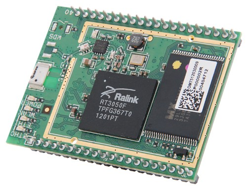

# [Raspberry Pi: Introducción al uso y programación](http://www.juntadeandalucia.es/educacion/portals/web/cep-jaen/index.php/es-ES/formacion/convocatorias/771-abierto-plazo-de-inscripcion-a-la-actividad-raspberry-pi-introduccion-al-uso-y-programacion-162319ge102)

## CEP de Jaen

23, 29 y 30 de Noviembre de 2016

## José Antonio Vacas  @javacasm

### [https://github.com/javacasm/RaspberryJaen](https://github.com/javacasm/RaspberryJaen)

# ¿Clones?

* BeagleBoard  ARM Cortex-A8 256MB 89€

* OLinuXino  Cortex A8 1GHz  512 MB 55€

UDOO=raspberry+arduino
6 ARM Cortex-A9 CPU Dua/Quad core 1GHz
1GB

Cubieboard ARM cortex-A8 y 512 MB 49$

Carambola 8devices (32Mb RAM) 22$

[Arduino Tre e Intel Galileo](http://blog.elcacharreo.com/2013/10/04/nuevos-arduino-galileo-y-tre/)

[Nanode y waspmote](http://blogthinkbig.com/4-alternativas-arduino-beaglebone-raspberrypi-nanode-waspmote/)

[Banana Pi](http://www.bananapi.org/)

[PCDuino](http://www.linksprite.com/linksprite-pcduino/)

...

### Refencias

[Alternativas](http://blogthinkbig.com/alternativas-raspberry-pi/)

[Otras placas similares](http://en.wikipedia.org/wiki/Raspberry_Pi#See_also)

[Comparativa entre clones](https://learn.adafruit.com/embedded-linux-board-comparison?view=all)
