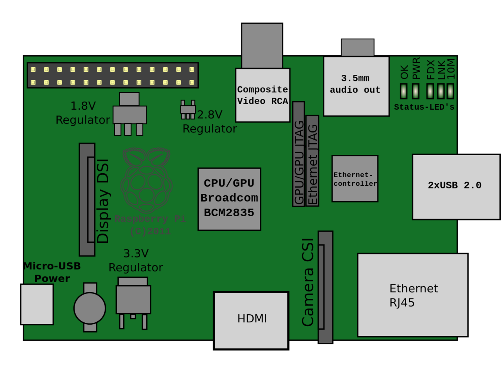

# [Raspberry Pi: Introducción al uso y programación](http://www.juntadeandalucia.es/educacion/portals/web/cep-jaen/index.php/es-ES/formacion/convocatorias/771-abierto-plazo-de-inscripcion-a-la-actividad-raspberry-pi-introduccion-al-uso-y-programacion-162319ge102)

## CEP de Jaen

16, 23 y 28 de Noviembre de 2017

## José Antonio Vacas  @javacasm

### [https://github.com/javacasm/RaspberryJaen](https://github.com/javacasm/RaspberryJaen)

# Arquitectura

Un diagrama simplificado de la arquitectura de Raspberry Pi

