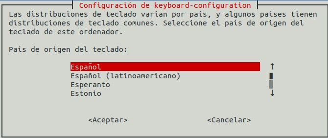

# [Raspberry Pi: Introducción al uso y programación](http://www.juntadeandalucia.es/educacion/portals/web/cep-jaen/index.php/es-ES/formacion/convocatorias/771-abierto-plazo-de-inscripcion-a-la-actividad-raspberry-pi-introduccion-al-uso-y-programacion-162319ge102)

## CEP de Jaen

23, 29 y 30 de Noviembre de 2016

## José Antonio Vacas  @javacasm

### [https://github.com/javacasm/RaspberryJaen](https://github.com/javacasm/RaspberryJaen)

# Instalación

¿Qué necesitamos?

* Formatear tarjeta ([http://www.sdcard.org/downloads/formatter_4/](http://www.sdcard.org/downloads/formatter_4/))
* Descargamos la imagen [http://www.raspberrypi.org/download](http://www.raspberrypi.org/download)
* ¿Qué imagen usar?
	* Empecemos con [Noobs](https://www.raspberrypi.org/blog/tag/noobs/)
	* [Instalación](https://www.raspberrypi.org/help/noobs-setup/)

* ¡¡¡Arrancar!!!
* Configuración

## Configuración

	sudo raspi-config

(Puede variar algo según la versión)

Una vez configurado podemos abrir el entorno visual con

	startx

En cualquier momento podemos volver a reconfigurar

	sudo raspi-config
