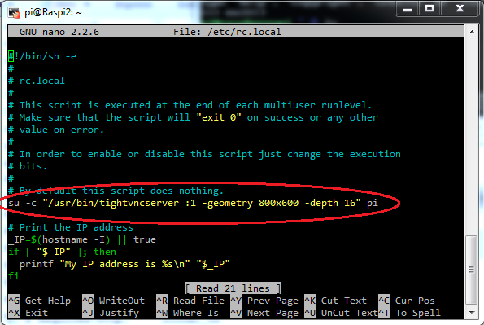

# [Raspberry Pi: Introducción al uso y programación](http://www.juntadeandalucia.es/educacion/portals/web/cep-jaen/index.php/es-ES/formacion/convocatorias/771-abierto-plazo-de-inscripcion-a-la-actividad-raspberry-pi-introduccion-al-uso-y-programacion-162319ge102)

## CEP de Jaen

23, 29 y 30 de Noviembre de 2016

## José Antonio Vacas  @javacasm

### [https://github.com/javacasm/RaspberryJaen](https://github.com/javacasm/RaspberryJaen)

# Manejando tu Raspberry Pi

Como sabes es una máquina Linux, con lo que podrás manejarla igual que se maneja cualquier otra máquina Linux

## Consola (línea de comandos)

kindle(RP para agentes secretos)(The importance of a sneaky ...)

### Comandos básicos:

* **ls** : muestra los archivos y directorios ( **ls -l** para más detalles y **ls -a** para mostrar todos)
* **cd** : cambia de directorio (**cd ~** nos lleva a nuestro directorio home y **cd ..** sale del directorio actual)
* **chmod** : cambia los permisos de un fichero/directorio (**chmod ugo-w fichero** quita todos los permisos de escritura)
* **pwd** : nos dice el directorio actual
* **mv** : mueve directorios/ficheros a un nuevo destino
* **rm** : borra directorios/ficheros
* **mkdir** : crea un directorio
* **passwd** : cambia la contraseña del usuario actual
* **ps -ef** : muestra los procesos en ejecución
* **top** : administrador de tareas
* **clear** : borra todo el contenido del terminal
* **df** : muestra el % de disco ocupado
* **nano** : editor de texto básico
* **vi** : editor de texto avanzado pero complejo
* **du** : muestra lo que ocupa un directorio (**du -s *** muestra lo que ocupa un directorio y todo lo que contiene)
* **sudo halt** apaga la raspberry
* **sudo shutdown -h now** apaga la raspberry
* **history** : muestra todos los comandos que se han ejecutado antes. Podemos ejecutar el comando de la posición n, con !n . Las teclas abajo/arriba del cursor nos permiten iterar por los comandos usados.
* La tecla Tabulador nos permite completar el nombre del fichero/directorio
* **man comando**: Para obtener ayuda sobre comando
* Para hacer fichero script: añadimos los comandos, chmod u+x fichero y para ejecutarlo ./fichero

### Usuarios

El usuario por defecto es "pi" con contraseña "raspberry"

### Cuidado con sudo

## Interface gráfico

## Acceso remoto

## [Conexión directa](./conexionDirecta.md)

## [Control con voz](./controlVoz.md)

### ssh

Es el protocolo de acceso por consola

Entramos en la configuración avanzada

	sudo raspi-config

Podemos hacerlo también por comandos con

	sudo service ssh start
	sudo insserv ssh

Ahora podremos conectarnos remotamente con ssh

	ssh pi@192.189.0.123

O
bien usando algún software como [Putty](http://www.chiark.greenend.org.uk/~sgtatham/putty/download.html)

### vnc

VNC es un protocolo que nos permite acceder remotamente al escritorio de otra máquina. Podemos instalarlo en nuestra Raspberry de manera sencilla con

	sudo apt-get install tightvncserver

Este software requiere que un servicio se ejecute al arrancar si queremos acceder en cualquier momento. Podemos instalarlo añadiendo la siguiente línea al archivo /etc/rc.local

	su -c "/usr/bin/tightvncserver :1 -geometry 800x600 -depth 16" pi

