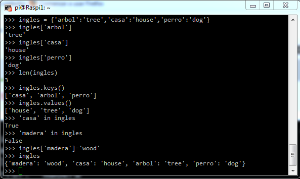

# [Raspberry Pi: Introducción al uso y programación](http://www.juntadeandalucia.es/educacion/portals/web/cep-jaen/index.php/es-ES/formacion/convocatorias/771-abierto-plazo-de-inscripcion-a-la-actividad-raspberry-pi-introduccion-al-uso-y-programacion-162319ge102)

## CEP de Jaen

23, 29 y 30 de Noviembre de 2016

## José Antonio Vacas  @javacasm

### [https://github.com/javacasm/RaspberryJaen](https://github.com/javacasm/RaspberryJaen)

# python

Es un lenguage moderno de gran productividad, sencillo, potente y con millones de líneas ya desarrolladas que se pueden usar directamente por medio de paquetes instalables

Se utiliza en la web, en aplicaciones de escritorio, etc... Gran parte del interface de linux lo utiliza

Podemos utilizar la herramienta Idle o python directamente para programar con él.

Veamos algunos ejemplos

* Operaciones numéricas y petición de datos al usuario

[Código de Suma](./codigo/suma.py)

* Sentencias de control condicionales

[Código de Bisiesto](./codigo/bisiesto.py)

* Sentencias de control de repetición

[Código de Buscando Caracteres](./codigo/buscaCaracter.py)

* Diccionarios que nos permitirán relacionar contenidos

* Veamos una implementación de un programa más elaborado como "Piedra, Papel o Tijera"

