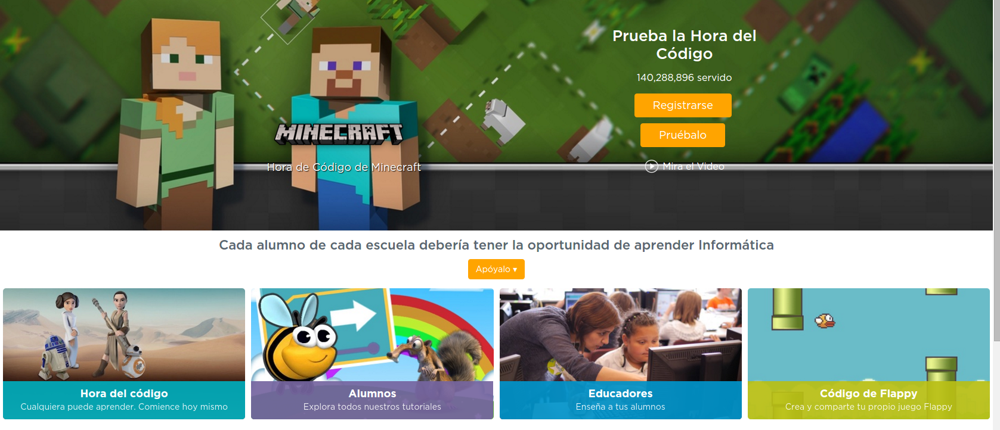

# [Raspberry Pi: Introducción al uso y programación](http://www.juntadeandalucia.es/educacion/portals/web/cep-jaen/index.php/es-ES/formacion/convocatorias/771-abierto-plazo-de-inscripcion-a-la-actividad-raspberry-pi-introduccion-al-uso-y-programacion-162319ge102)

## CEP de Jaen

23, 29 y 30 de Noviembre de 2016

## José Antonio Vacas  @javacasm

### [https://github.com/javacasm/RaspberryJaen](https://github.com/javacasm/RaspberryJaen)

# Scratch

Podemos probarlo [online](https://scratch.mit.edu/projects/editor/)

Está pensado para enseñar a programar sin la complejidad de la sintaxis.

Otros similares

* [Snap!](snap.berkeley.edu)

* [Code.org](Code.org)

